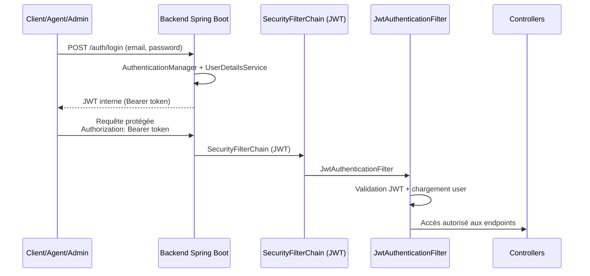
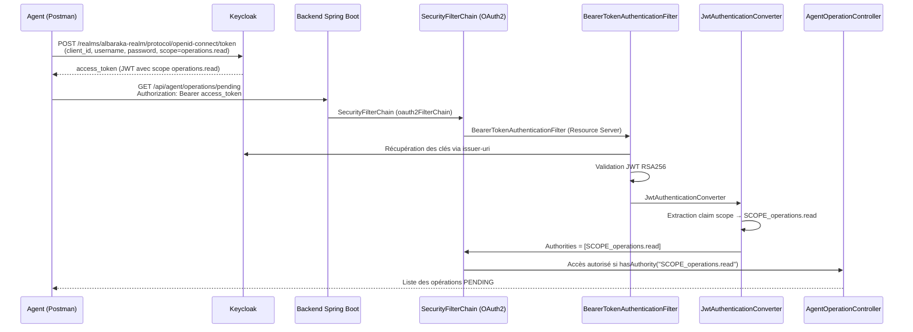

# 🏦 Al Baraka Digital Bank

<div align="center">


### Plateforme bancaire digitale sécurisée avec validation automatique des opérations

[Installation](#-installation) • [Endpoints](#-endpoints-principaux) • [Sécurité](#-sécurité)

</div>

---

## 📋 Vue d'ensemble

Solution bancaire moderne avec **validation intelligente** des opérations :

- ✅ Dépôts, retraits, virements sécurisés
- ✅ Validation automatique si montant ≤ 10 000 DH
- ✅ Workflow d'approbation agent si > 10 000 DH
- ✅ Authentification JWT + OAuth2
- ✅ Gestion documentaire (PDF/JPG/PNG)

---

## 🎯 Fonctionnalités

| Rôle | Actions |
|------|---------|
| **👤 Client** | Dépôt, retrait, virement, upload justificatif |
| **👨‍💼 Agent** | Validation opérations > 10K, vérification documents (OAuth2) |
| **👔 Admin** | Gestion comptes, activation/désactivation |

---

## 🔐 Sécurité

### Architecture double authentification

Le backend utilise **deux chaînes de filtrage Spring Security distinctes** :

1. **JWT interne** : Pour `/api/client/**`, `/api/agent/**` (sauf pending), `/api/admin/**`
2. **OAuth2 Resource Server** : Pour `/api/agent/operations/pending` avec Keycloak

### Règles de validation automatique

| Montant | Action | Justificatif |
|---------|--------|--------------|
| ≤ 10 000 DH | ✅ Validé automatiquement | ❌ Non requis |
| > 10 000 DH | ⏳ Validation agent (OAuth2) | ✅ Obligatoire |

---

## 🛡️ Flux d'Authentification

### 1️⃣ Flux JWT interne (CLIENT / AGENT_BANCAIRE / ADMIN)


---

### 2️⃣ Flux OAuth2 Keycloak (GET /api/agent/operations/pending)


---

## 🚀 Installation

### Option 1 : Locale
```bash
# 1. Clone
git clone https://github.com/votre-org/albaraka-bank.git
cd albaraka-bank

# 2. Database
psql -U postgres -c "CREATE DATABASE albaraka_db;"

# 3. Config (voir application.properties)

# 4. Run
mvn clean install
mvn spring-boot:run
```

### Option 2 : Docker
```bash
docker compose up --build
# App: http://localhost:8080
# DB: localhost:5432
```

> ⚠️ **Note** : Keycloak doit être lancé séparément sur `http://localhost:8081`

---

## ⚙️ Configuration

### application.properties
```properties
# Database
spring.datasource.url=${DB_URL:jdbc:postgresql://localhost:5432/albaraka_db}
spring.datasource.username=${DB_USER:postgres}
spring.datasource.password=${DB_PASSWORD:salmahm}

# JWT
security.jwt.secret=${JWT_SECRET:CHANGE_ME_USE_A_LONG_RANDOM_SECRET_KEY}
security.jwt.expiration-ms=3600000

# OAuth2 Keycloak
spring.security.oauth2.resourceserver.jwt.issuer-uri=http://localhost:8081/realms/albaraka-realm
```

### Variables d'environnement supportées

| Variable | Description | Valeur par défaut |
|----------|-------------|-------------------|
| `DB_URL` | URL PostgreSQL | `jdbc:postgresql://localhost:5432/albaraka_db` |
| `DB_USER` | User DB | `postgres` |
| `DB_PASSWORD` | Password DB | `salmahm` |
| `JWT_SECRET` | Secret JWT | `CHANGE_ME_USE_A_LONG_RANDOM_SECRET_KEY` |

---

## 📡 Endpoints principaux

### 🔐 Auth

| Méthode | Endpoint | Description |
|---------|----------|-------------|
| POST | `/auth/register` | Inscription utilisateur |
| POST | `/auth/login` | Connexion (retourne JWT) |

---

### 👤 Client `/api/client/**`

**Auth** : JWT Bearer | **Rôle** : `CLIENT`

| Méthode | Endpoint | Description |
|---------|----------|-------------|
| GET | `/api/client/account/me` | Infos du compte client |
| POST | `/api/client/operations` | Créer opération (DEPOSIT/WITHDRAWAL/TRANSFER) |
| GET | `/api/client/operations` | Lister mes opérations (pagination) |
| POST | `/api/client/operations/{id}/document` | Upload justificatif (PDF/JPG/PNG) |

**Règles** :
- Montant ≤ 10 000 DH → `VALIDATED` automatiquement
- Montant > 10 000 DH → `PENDING` + justificatif obligatoire

---

### 👨‍💼 Agent `/api/agent/**`

| Méthode | Endpoint | Auth | Description |
|---------|----------|------|-------------|
| GET | `/api/agent/operations/pending` | **OAuth2** + scope `operations.read` | Lister opérations PENDING |
| PUT | `/api/agent/operations/{id}/approve` | JWT + rôle `AGENT_BANCAIRE` | Approuver opération |
| PUT | `/api/agent/operations/{id}/reject` | JWT + rôle `AGENT_BANCAIRE` | Rejeter opération |
| GET | `/api/agent/operations/{id}/documents` | JWT + rôle `AGENT_BANCAIRE` | Lister justificatifs |
| GET | `/api/agent/documents/{id}/download` | JWT + rôle `AGENT_BANCAIRE` | Télécharger justificatif |

---

### 👔 Admin `/api/admin/**`

**Auth** : JWT Bearer | **Rôle** : `ADMIN`

| Méthode | Endpoint | Description |
|---------|----------|-------------|
| POST | `/api/admin/users` | Créer utilisateur |
| GET | `/api/admin/users` | Lister utilisateurs (pagination) |
| GET | `/api/admin/users/{id}` | Détails utilisateur |
| PUT | `/api/admin/users/{id}/status` | Activer/désactiver utilisateur |
| DELETE | `/api/admin/users/{id}` | Supprimer utilisateur |

---

## 🔄 Workflow des opérations
```
Client crée opération
         │
    Montant ≤ 10K ?
         │
    ┌────┴────┐
   OUI       NON
    │         │
VALIDATED   PENDING
    │         │
    │    Upload justificatif
    │         │
    │    Agent OAuth2 → GET /pending
    │         │
    │    Approve/Reject (JWT)
    │         │
    └────┬────┘
         │
  Solde mis à jour
```

---

## 📊 Modèle de données
```sql
User
├─ id (Long)
├─ email (String, unique)
├─ password (String, BCrypt)
├─ fullName (String)
├─ role (Enum: CLIENT, AGENT_BANCAIRE, ADMIN)
├─ active (Boolean)
└─ createdAt (Timestamp)

Account
├─ id (Long)
├─ accountNumber (String, unique)
├─ balance (BigDecimal)
├─ userId (Long, FK → User)
└─ status (Enum: ACTIVE, SUSPENDED)

Operation
├─ id (Long)
├─ type (Enum: DEPOSIT, WITHDRAWAL, TRANSFER)
├─ amount (BigDecimal)
├─ status (Enum: PENDING, VALIDATED, REJECTED)
├─ accountSourceId (Long, FK → Account)
├─ accountDestinationId (Long, FK → Account, nullable)
├─ createdAt (Timestamp)
├─ validatedAt (Timestamp, nullable)
└─ executedAt (Timestamp, nullable)

Document
├─ id (Long)
├─ fileName (String)
├─ fileType (String)
├─ storagePath (String)
├─ operationId (Long, FK → Operation)
└─ uploadedAt (Timestamp)
```

---

## 🛠️ Technologies

| Catégorie | Technologie | Version |
|-----------|-------------|---------|
| **Language** | Java (OpenJDK Corretto) | 17 |
| **Framework** | Spring Boot | 3.x |
| **Sécurité** | Spring Security | 6.x |
| **Base de données** | PostgreSQL | 16 |
| **Auth Provider** | Keycloak | 23+ |
| **Build** | Maven | 3.9+ |
| **Container** | Docker | 24+ |

---

## 🐳 Docker

### docker-compose.yml
```yaml
services:
  db:
    image: postgres:16
    environment:
      POSTGRES_DB: albaraka_db
      POSTGRES_USER: postgres
      POSTGRES_PASSWORD: salmahm
    ports:
      - "5432:5432"
    volumes:
      - postgres_data:/var/lib/postgresql/data

  backend:
    build:
      context: .
      dockerfile: Dockerfile
    ports:
      - "8080:8080"
    environment:
      DB_URL: jdbc:postgresql://db:5432/albaraka_db
      DB_USER: postgres
      DB_PASSWORD: salmahm
      JWT_SECRET: ${JWT_SECRET:-CHANGE_ME_USE_A_LONG_RANDOM_SECRET_KEY}
    depends_on:
      - db

volumes:
  postgres_data:
```

### Lancement
```bash
# Build et run
docker compose up --build

# Stop
docker compose down

# Logs
docker compose logs -f backend
```

### Keycloak (séparé)
```bash
docker run -p 8081:8080 \
  -e KEYCLOAK_ADMIN=admin \
  -e KEYCLOAK_ADMIN_PASSWORD=admin \
  quay.io/keycloak/keycloak:23.0 \
  start-dev
```

---

## 🔍 Dépannage

| Problème | Solution |
|----------|----------|
| `Connection refused` PostgreSQL | Vérifier que PostgreSQL tourne sur port 5432 |
| `JWT token invalid` | Vérifier `JWT_SECRET` dans application.properties |
| `403 Forbidden` OAuth2 | Vérifier le scope `operations.read` dans le token |
| `File upload error` | Max 5MB, formats: PDF/JPG/PNG uniquement |
| `Keycloak 401` | Vérifier username/password et que le realm existe |

---

## 👥 Utilisateurs de test

| Rôle | Email | Password |
|------|-------|----------|
| CLIENT | client1@gmail.com | client1-pass |
| AGENT | agentbaraka@gmail.com | malika-pass |
| ADMIN | admin@gmail.com | admin-pass |

---

## 📞 Support

- **Collection Postman** : `Al-barka-bank.postman_collection.json`
- **Documentation** : Ce README

---

<div align="center">

**Développé avec ❤️ pour Al Baraka Digital Bank**

Par **Salma Hamdi**

[](https://spring.io/projects/spring-boot)
[](https://www.postgresql.org/)
[](https://www.keycloak.org/)

</div>