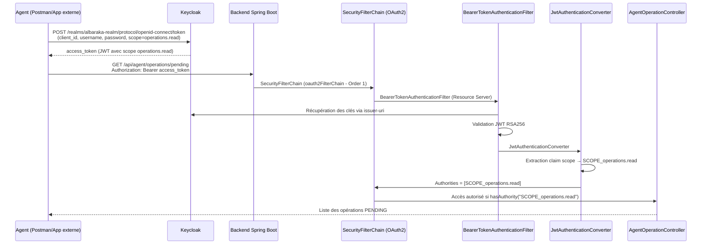
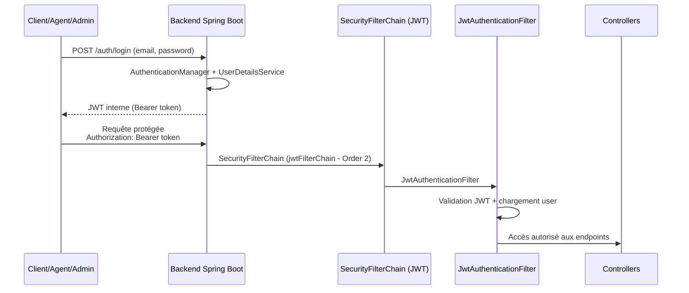
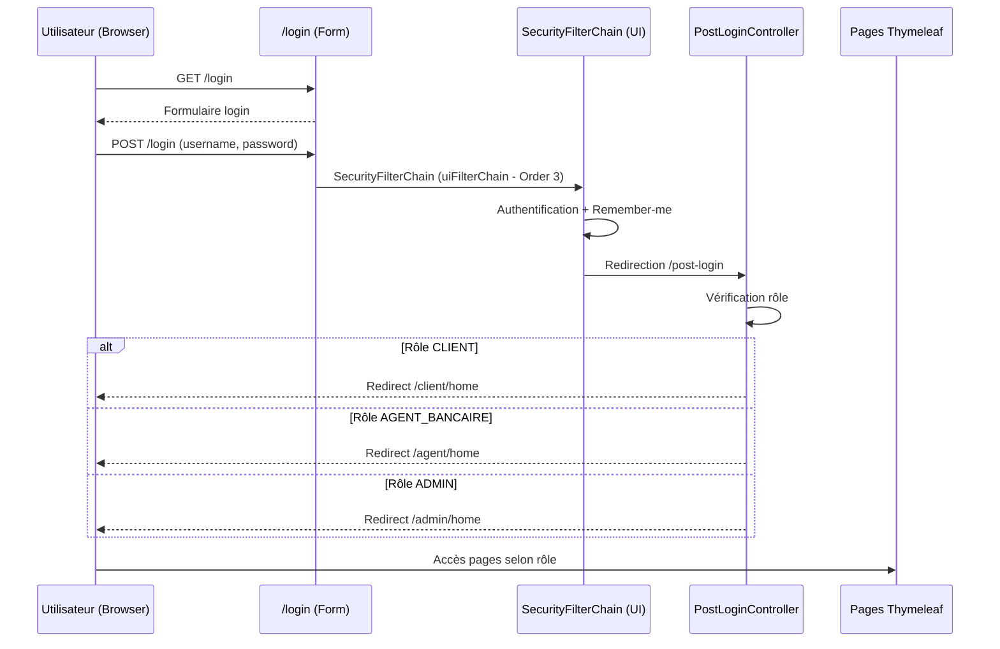

# 🏦 Al Baraka Digital Bank

<div align="center">


### Plateforme bancaire digitale sécurisée avec validation automatique des opérations et intelligence artificielle

[Installation](#-installation) • [Endpoints](#-endpoints-principaux) • [Sécurité](#-sécurité) • [Interface Web](#-interface-web-thymeleaf) • [CI/CD](#-cicd-github-actions)

</div>

---

## 📋 Vue d'ensemble

Solution bancaire moderne avec **validation intelligente** des opérations et **analyse IA** :

- ✅ Dépôts, retraits, virements sécurisés
- ✅ Validation automatique si montant ≤ 10 000 DH
- ✅ Workflow d'approbation agent si > 10 000 DH avec analyse IA
- ✅ Double authentification JWT + OAuth2 Resource Server
- ✅ Gestion documentaire (PDF/JPG/PNG)
- ✅ Interface web Thymeleaf sécurisée pour tous les rôles
- ✅ CI/CD automatisé avec GitHub Actions
- ✅ Publication Docker Hub automatique

---

## 🎯 Fonctionnalités

| Rôle | Actions Web UI | Actions API REST |
|------|----------------|------------------|
| **👤 Client** | Dashboard, historique opérations, création opérations, upload justificatifs | POST/GET opérations, upload documents |
| **👨‍💼 Agent** | Validation opérations PENDING, consultation recommandations IA | GET pending (OAuth2), approve/reject (JWT) |
| **👔 Admin** | Gestion utilisateurs, activation/désactivation comptes | CRUD utilisateurs, gestion statuts |

---

## 🔐 Sécurité

### Architecture triple authentification

Le backend utilise **trois chaînes de filtrage Spring Security distinctes** :

1. **OAuth2 Resource Server** : Pour `/api/agent/operations/pending` avec Keycloak
2. **JWT interne** : Pour `/api/client/**`, `/api/agent/**` (sauf pending), `/api/admin/**`
3. **Form Login** : Pour interface web Thymeleaf `/login`, `/client/**`, `/agent/**`, `/admin/**`

### Règles de validation automatique

| Montant | Action | Justificatif | Analyse IA |
|---------|--------|--------------|------------|
| ≤ 10 000 DH | ✅ Validé automatiquement | ❌ Non requis | ❌ Non requise |
| > 10 000 DH | ⏳ Validation agent (OAuth2) | ✅ Obligatoire | ✅ Recommandation automatique |

---

## 🤖 Intelligence Artificielle (Préparation Spring AI)

### Service d'analyse IA : `AiOperationAnalysisService`

Le système intègre un **service d'analyse IA simulé** qui prépare l'intégration future avec Spring AI :

**Décisions IA possibles** :
- `APPROVE` : Opération à faible risque
- `REJECT` : Opération à risque élevé  
- `NEED_HUMAN_REVIEW` : Révision humaine nécessaire

**Logique actuelle (simulation)** :
```
Montant ≤ 10 000 DH     → APPROVE
10 000 < Montant ≤ 50 000 → NEED_HUMAN_REVIEW
Montant > 50 000 DH      → REJECT
```

**Fonctionnement** :
1. Génération d'un prompt textuel analysant :
   - Type d'opération
   - Montant
   - Historique du compte
   - Justificatifs fournis
2. Log du prompt pour debug (préparation intégration modèle externe)
3. Retour d'une recommandation au format `AiDecisionResult`
4. **Décision finale toujours prise par l'agent bancaire** (conformité)

---

## 🛡️ Flux d'Authentification

### 1️⃣ Flux OAuth2 Keycloak (GET /api/agent/operations/pending)


---

### 2️⃣ Flux JWT interne (CLIENT / AGENT_BANCAIRE / ADMIN)


---

### 3️⃣ Flux Form Login (Interface Web Thymeleaf)


---

## 🌐 Interface Web Thymeleaf

### Architecture UI sécurisée

L'application propose une **interface web complète** en plus des API REST :

**Contrôleurs MVC** :
- `LoginController` : Formulaire de connexion personnalisé
- `LoginRedirectController` : Redirection post-login par rôle
- `ClientWebController` : Dashboard client, création opérations, historique
- `AgentWebController` : Dashboard agent, validation opérations PENDING
- `AdminWebController` : Gestion utilisateurs, activation/désactivation

**URLs publiques** :
- `/login` : Formulaire de connexion
- `/logout` : Déconnexion
- `/access-denied` : Page d'erreur 403

**URLs protégées par rôle** :
- `/client/**` : Nécessite rôle `CLIENT`
- `/agent/**` : Nécessite rôle `AGENT_BANCAIRE`  
- `/admin/**` : Nécessite rôle `ADMIN`

---

## 🚀 Installation

### Option 1 : Locale
```bash
# 1. Clone
git clone https://github.com/votre-org/albaraka-bank.git
cd albaraka-bank

# 2. Database
psql -U postgres -c "CREATE DATABASE albaraka_db;"

# 3. Config (voir application.properties)

# 4. Run
mvn clean install
mvn spring-boot:run
```

### Option 2 : Docker Hub (Image prête)
```bash
# Pull depuis Docker Hub
docker pull salmahamdi/albaraka-bank:latest

# Run avec config
docker run -p 8080:8080 \
  -e JWT_SECRET=changeme-long-secret \
  -e DB_URL=jdbc:postgresql://host.docker.internal:5432/albaraka_db \
  -e DB_USER=postgres \
  -e DB_PASSWORD=postgres \
  salmahamdi/albaraka-bank:latest
```

### Option 3 : Docker Compose
```bash
docker compose up --build
# App: http://localhost:8080
# DB: localhost:5432
```

> ⚠️ **Note** : Keycloak doit être lancé séparément sur `http://localhost:8081`

---

## ⚙️ Configuration

### application.properties
```properties
# Database
spring.datasource.url=${DB_URL:jdbc:postgresql://localhost:5432/albaraka_db}
spring.datasource.username=${DB_USER:postgres}
spring.datasource.password=${DB_PASSWORD:yourpassword}

# JWT
security.jwt.secret=${JWT_SECRET:LONG_RANDOM_SECRET_KEY}
security.jwt.expiration-ms=3600000

# OAuth2 Keycloak
spring.security.oauth2.resourceserver.jwt.issuer-uri=http://localhost:8081/realms/albaraka-realm

# Thymeleaf
spring.thymeleaf.cache=false
spring.thymeleaf.prefix=classpath:/templates/
spring.thymeleaf.suffix=.html

# Profiles
spring.profiles.active=${SPRING_PROFILES_ACTIVE:dev}
```

### Variables d'environnement supportées

| Variable | Description | Valeur par défaut |
|----------|-------------|-------------------|
| `DB_URL` | URL PostgreSQL | `jdbc:postgresql://localhost:5432/albaraka_db` |
| `DB_USER` | User DB | `postgres` |
| `DB_PASSWORD` | Password DB | `yourpassword` |
| `JWT_SECRET` | Secret JWT | `LONG_RANDOM_SECRET_KEY` |
| `SPRING_PROFILES_ACTIVE` | Profil Spring | `dev` ou `docker` |

---

## 📡 Endpoints principaux

### 🔐 Auth

| Méthode | Endpoint | Description |
|---------|----------|-------------|
| POST | `/auth/register` | Inscription utilisateur |
| POST | `/auth/login` | Connexion (retourne JWT) |
| GET | `/login` | Formulaire de connexion web |
| POST | `/login` | Connexion form (redirection /post-login) |
| GET | `/logout` | Déconnexion |

---

### 👤 Client `/api/client/**`

**Auth** : JWT Bearer | **Rôle** : `CLIENT`

| Méthode | Endpoint | Description |
|---------|----------|-------------|
| GET | `/api/client/account/me` | Infos du compte client |
| POST | `/api/client/operations` | Créer opération (DEPOSIT/WITHDRAWAL/TRANSFER) |
| GET | `/api/client/operations` | Lister mes opérations (pagination) |
| POST | `/api/client/operations/{id}/document` | Upload justificatif (PDF/JPG/PNG) |

**URLs Web** :
| Méthode | URL | Description |
|---------|-----|-------------|
| GET | `/client/home` | Dashboard client |
| GET | `/client/operations` | Historique opérations |
| GET | `/client/operations/create` | Formulaire création opération |
| POST | `/client/operations/create` | Soumission création |

**Règles** :
- Montant ≤ 10 000 DH → `VALIDATED` automatiquement
- Montant > 10 000 DH → `PENDING` + justificatif obligatoire + analyse IA

---

### 👨‍💼 Agent `/api/agent/**`

| Méthode | Endpoint | Auth | Description |
|---------|----------|------|-------------|
| GET | `/api/agent/operations/pending` | **OAuth2** + scope `operations.read` | Lister opérations PENDING |
| PUT | `/api/agent/operations/{id}/approve` | JWT + rôle `AGENT_BANCAIRE` | Approuver opération |
| PUT | `/api/agent/operations/{id}/reject` | JWT + rôle `AGENT_BANCAIRE` | Rejeter opération |
| GET | `/api/agent/operations/{id}/documents` | JWT + rôle `AGENT_BANCAIRE` | Lister justificatifs |
| GET | `/api/agent/documents/{id}/download` | JWT + rôle `AGENT_BANCAIRE` | Télécharger justificatif |

**URLs Web** :
| Méthode | URL | Description |
|---------|-----|-------------|
| GET | `/agent/home` | Dashboard agent |
| GET | `/agent/operations/pending` | Liste opérations PENDING avec recommandations IA |
| POST | `/agent/operations/{id}/approve` | Approuver avec note |
| POST | `/agent/operations/{id}/reject` | Rejeter avec motif |

---

### 👔 Admin `/api/admin/**`

**Auth** : JWT Bearer | **Rôle** : `ADMIN`

| Méthode | Endpoint | Description |
|---------|----------|-------------|
| POST | `/api/admin/users` | Créer utilisateur |
| GET | `/api/admin/users` | Lister utilisateurs (pagination) |
| GET | `/api/admin/users/{id}` | Détails utilisateur |
| PUT | `/api/admin/users/{id}/status` | Activer/désactiver utilisateur |
| DELETE | `/api/admin/users/{id}` | Supprimer utilisateur |

**URLs Web** :
| Méthode | URL | Description |
|---------|-----|-------------|
| GET | `/admin/home` | Dashboard admin |
| GET | `/admin/users` | Liste utilisateurs avec filtres |
| POST | `/admin/users/{id}/toggle-status` | Activer/désactiver |

---

## 🔄 Workflow des opérations avec IA
```
Client crée opération
         │
    Montant ≤ 10K ?
         │
    ┌────┴────┐
   OUI       NON
    │         │
VALIDATED   PENDING
    │         │
    │    Upload justificatif
    │         │
    │    Analyse IA automatique
    │         │
    │    ┌─────────────┐
    │    │ Recommandation IA │
    │    ├─────────────┤
    │    │ • APPROVE   │
    │    │ • REJECT    │
    │    │ • REVIEW    │
    │    └─────────────┘
    │         │
    │    Agent OAuth2 → GET /pending
    │         │
    │    Décision finale Agent
    │         │
    │    Approve/Reject (JWT)
    │         │
    └────┬────┘
         │
  Solde mis à jour
  + Log décision IA vs Agent
```

---

## 📊 Modèle de données
```sql
User
├─ id (Long)
├─ email (String, unique)
├─ password (String, BCrypt)
├─ fullName (String)
├─ role (Enum: CLIENT, AGENT_BANCAIRE, ADMIN)
├─ active (Boolean)
└─ createdAt (Timestamp)

Account
├─ id (Long)
├─ accountNumber (String, unique)
├─ balance (BigDecimal)
├─ userId (Long, FK → User)
└─ status (Enum: ACTIVE, SUSPENDED)

Operation
├─ id (Long)
├─ type (Enum: DEPOSIT, WITHDRAWAL, TRANSFER)
├─ amount (BigDecimal)
├─ status (Enum: PENDING, VALIDATED, REJECTED)
├─ accountSourceId (Long, FK → Account)
├─ accountDestinationId (Long, FK → Account, nullable)
├─ createdAt (Timestamp)
├─ validatedAt (Timestamp, nullable)
├─ executedAt (Timestamp, nullable)
└─ aiRecommendation (String, nullable)

Document
├─ id (Long)
├─ fileName (String)
├─ fileType (String)
├─ storagePath (String)
├─ operationId (Long, FK → Operation)
└─ uploadedAt (Timestamp)
```

---

## 🛠️ Technologies

| Catégorie | Technologie | Version |
|-----------|-------------|---------|
| **Language** | Java (OpenJDK Corretto) | 17 |
| **Framework** | Spring Boot | 3.x |
| **Sécurité** | Spring Security | 6.x |
| **UI** | Thymeleaf | 3.1+ |
| **Base de données** | PostgreSQL | 16 |
| **Auth Provider** | Keycloak | 23+ |
| **Build** | Maven | 3.9+ |
| **Container** | Docker | 24+ |
| **CI/CD** | GitHub Actions | - |
| **Registry** | Docker Hub | salmahamdi/albaraka-bank |

---

## 🐳 Docker

### Dockerfile (Multi-stage)
```dockerfile
# Étape 1 : Build Maven
FROM maven:3.9.9-eclipse-temurin-21 AS build
WORKDIR /app
COPY pom.xml .
COPY src ./src
RUN mvn -q -DskipTests clean package

# Étape 2 : Image de runtime
FROM eclipse-temurin:21-jre-alpine
WORKDIR /app

# Variables d'environnement par défaut
ENV JWT_SECRET=LONG_RANDOM_SECRET_KEY \
    DB_URL=jdbc:postgresql://db:5432/albaraka_db \
    DB_USER=postgres \
    DB_PASSWORD=yourpassword \
    SPRING_PROFILES_ACTIVE=docker

COPY --from=build /app/target/*.jar app.jar
EXPOSE 8080
ENTRYPOINT ["java","-jar","/app/app.jar"]
```

### docker-compose.yml
```yaml
services:
  db:
    image: postgres:16
    environment:
      POSTGRES_DB: albaraka_db
      POSTGRES_USER: postgres
      POSTGRES_PASSWORD: yourpassword
    ports:
      - "5432:5432"
    volumes:
      - postgres_data:/var/lib/postgresql/data
    healthcheck:
      test: ["CMD-SHELL", "pg_isready -U postgres"]
      interval: 10s
      timeout: 5s
      retries: 5

  backend:
    build:
      context: .
      dockerfile: Dockerfile
    ports:
      - "8080:8080"
    environment:
      DB_URL: jdbc:postgresql://db:5432/albaraka_db
      DB_USER: postgres
      DB_PASSWORD: yourpassword
      JWT_SECRET: ${JWT_SECRET:-LONG_RANDOM_SECRET_KEY}
      SPRING_PROFILES_ACTIVE: docker
    depends_on:
      db:
        condition: service_healthy

volumes:
  postgres_data:
```

### Lancement
```bash
# Build et run
docker compose up --build

# Stop
docker compose down

# Logs
docker compose logs -f backend

# Pull depuis Docker Hub
docker pull salmahamdi/albaraka-bank:latest
```

### Keycloak (séparé)
```bash
docker run -p 8081:8080 \
  -e KEYCLOAK_ADMIN=admin \
  -e KEYCLOAK_ADMIN_PASSWORD=admin \
  quay.io/keycloak/keycloak:23.0 \
  start-dev
```

---

## 🔄 CI/CD GitHub Actions

### Architecture CI/CD

Le projet utilise **deux workflows GitHub Actions** :

#### 1️⃣ CI - Build & Tests Maven

**Fichier** : `.github/workflows/ci.yml`

**Déclenchement** : Push et Pull Request sur `main`/`master`

**Résultat** : Validation du build et exécution des tests unitaires

---

#### 2️⃣ CD - Build & Push Docker Hub

**Fichier** : `.github/workflows/cd-docker.yml`

**Déclenchement** : Push sur `main`/`master` uniquement

**Secrets requis** (Settings → Secrets) :
- `DOCKERHUB_USERNAME` : salmahamdi
- `DOCKERHUB_TOKEN` : Personal Access Token Docker Hub

**Résultat** : 
- Image Docker buildée et publiée sur Docker Hub
- Deux tags générés :
  - `salmahamdi/albaraka-bank:latest` (dernière version)
  - `salmahamdi/albaraka-bank:<commit-sha>` (version spécifique)

---

### Schéma CI/CD
```
Developer
    ↓
Push code → GitHub Repository
    ↓
    ├─→ CI Workflow (on push/PR)
    │   ├─ Checkout code
    │   ├─ Setup JDK 17
    │   ├─ Maven build
    │   └─ Run tests
    │
    └─→ CD Workflow (on push to main)
        ├─ Checkout code
        ├─ Login Docker Hub
        ├─ Build Docker image
        └─ Push to salmahamdi/albaraka-bank:latest
                                            :sha
    ↓
Docker Hub Registry
    ↓
Anyone can pull → docker pull salmahamdi/albaraka-bank:latest
```

---
HUB_TOKEN` |
| Docker image non publiée | Vérifier que le push est sur `main`/`master` |

---

## 📞 Support & Documentation

- **Collection Postman** : `Al-barka-bank.postman_collection.json`
- **GitHub Repository** : [saalmahm/albaraka-bank]([https://github.com/votre-org/albaraka-bank](https://github.com/saalmahm/albaraka-bank))
- **Docker Hub** : [salmahamdi/albaraka-bank](https://hub.docker.com/r/salmahamdi/albaraka-bank)
- **Documentation** : Ce README

---

## 🚀 Démarrage rapide

### Pour développement
```bash
git clone https://github.com/votre-org/albaraka-bank.git
cd albaraka-bank
mvn spring-boot:run
# Accès : http://localhost:8080/login
```

### Pour production (Docker)
```bash
docker pull salmahamdi/albaraka-bank:latest
docker run -p 8080:8080 \
  -e JWT_SECRET=your-secret-key \
  -e DB_URL=jdbc:postgresql://your-db:5432/albaraka_db \
  -e DB_USER=postgres \
  -e DB_PASSWORD=your-password \
  salmahamdi/albaraka-bank:latest
```

---

<div align="center">

**Développé avec ❤️ pour Al Baraka Digital Bank**

Par **Salma Hamdi**

[](https://spring.io/projects/spring-boot)
[](https://www.postgresql.org/)
[](https://www.keycloak.org/)
[](https://www.thymeleaf.org/)
[](https://hub.docker.com/r/salmahamdi/albaraka-bank)

**🌟 Mettez une étoile à ce dépôt si vous le trouvez utile !**

</div>